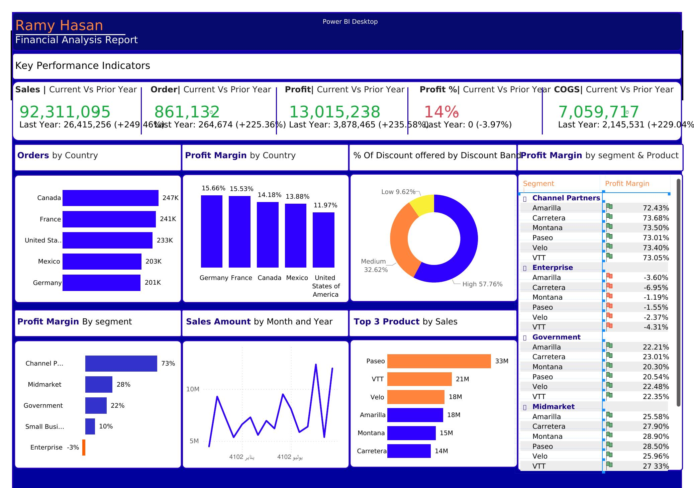

# 📊 Financial Analysis Report — Power BI Dashboard

> **A comprehensive financial performance dashboard built with Power BI, analyzing Sales, Profit, Orders, and COGS across countries, segments, and products.**

---

## 📥 Download

[](./Financial_Analysis_Report.pdf)
[](./Ramy_Financial_Analysis_Report.pbit)

---

## 🖼️ Dashboard Preview



---

## 🗂️ Project Overview

This Power BI dashboard provides a full financial analysis comparing **Current Year vs Prior Year** performance across 5 key metrics, with drill-down views by country, product, segment, and discount band.

**Key questions this dashboard answers:**
- How did sales & profit grow compared to last year?
- Which countries and segments are most profitable?
- Which products drive the most revenue?
- Where are we losing margin (e.g. Enterprise segment)?
- How does discount strategy impact profitability?

---

## 📁 Repository Structure

```
📦 financial-analysis-dashboard
 ┣ 📊 Ramy_Financial_Analysis_Report.pbit   ← Power BI Template
 ┣ 📑 Financial_Analysis_Report.pdf         ← Exported Report
 ┣ 🖼️ financial_dashboard_preview.jpg       ← Dashboard Screenshot
 ┗ 📄 README.md
```

---

## 📈 Key Performance Indicators (Current Year)

| KPI | Current Year | Prior Year | YoY Change |
|-----|-------------|------------|------------|
| 💰 Sales | 92,311,095 | 26,415,256 | **+249.46%** |
| 📦 Orders | 861,132 | 264,674 | **+225.36%** |
| 📊 Profit | 13,015,238 | 3,878,465 | **+235.58%** |
| 📉 Profit % | 14% | ~18% | **-3.97%** |
| 🏭 COGS | 7,059,717 | 2,145,531 | **+229.04%** |

---

## 🌍 Performance by Country

| Country | Orders | Profit Margin |
|---------|--------|---------------|
| 🇩🇪 Germany | 201K | **15.66%** — Highest |
| 🇫🇷 France | 241K | 15.53% |
| 🇨🇦 Canada | 247K — Most Orders | 14.18% |
| 🇲🇽 Mexico | 203K | 13.88% |
| 🇺🇸 United States | 233K | 11.97% |

---

## 🏷️ Profit Margin by Segment

| Segment | Profit Margin | Status |
|---------|--------------|--------|
| Channel Partners | **73%** | ✅ Highest |
| Midmarket | 28% | ✅ Good |
| Government | 22% | ✅ Stable |
| Small Business | 10% | ⚠️ Low |
| Enterprise | **-3%** | ❌ Loss-making |

> **Key Insight:** Enterprise is the only loss-making segment. Despite high volume, pricing or cost structure needs urgent review.

---

## 🏆 Top Products by Sales

| Rank | Product | Sales |
|------|---------|-------|
| 🥇 1 | Paseo | 33M |
| 🥈 2 | VTT | 21M |
| 🥉 3 | Velo | 18M |
| 4 | Amarilla | 18M |
| 5 | Montana | 15M |
| 6 | Carretera | 14M |

---

## 🎯 Discount Band Distribution

| Band | % of Discounts |
|------|---------------|
| High | 57.76% |
| Medium | 32.62% |
| Low | 9.62% |

---

## 💡 Key Insights

1. **Explosive Growth** — Sales grew +249% YoY, but Profit Margin dropped 3.97%, meaning cost management needs attention as scale increases.
2. **Enterprise is a Red Flag** — Selling a lot but losing money (-3% margin). Price adjustments or cost reduction are critical.
3. **Channel Partners = Gold** — 73% profit margin is exceptional. This segment deserves more investment and focus.
4. **Germany Leads Efficiency** — Highest profit margin (15.66%) despite not having the most orders.
5. **Paseo Dominates Sales** — But Channel Partners segment products all maintain 73%+ margins regardless of product.

---

## 🛠️ Tools & Skills Used


**Techniques used:**
- Current vs Prior Year comparisons using DAX time intelligence
- Dynamic KPI cards with YoY % change
- Profit Margin analysis by segment × product matrix
- Geographic performance breakdown
- Discount band impact analysis

---

## 👤 Author

**Ramy Hasan**
Data Analyst | Power BI Developer

[](https://www.linkedin.com/in/ramyhasan)

---

## 📄 License

This project is for portfolio and educational purposes.
